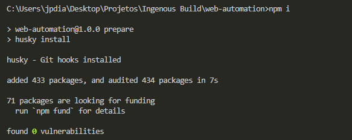
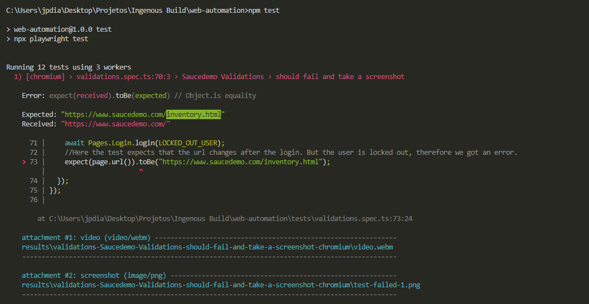

# API Challenge — Joao Paulo Dias
Hello, my name is Joao Paulo Dias and I did this challenge aiming to be your Senior QA Engineer. I love programming and testing, therefore I love to automate testing scenarios
## What the project is about and why the language and tools selected
This project is responsible for automating Web testing on [Saucedemo.com](https://www.saucedemo.com/) using Typescript, Playwright, Pure-gen and Husky. They were selected because: 
- Playwright has gained territory with some features that can be problematic in others automation tools, like record video during the test execution, create custom reports or integrate them with third-party tools, screenshots and web browser installation, configuration and running tests in more than one. I appreciate this framework and use it daily. 
- Typescript is an amazing option to programming because the Javascript/Typescript community is large and it possibilitates quick solutions to problems.
- Pure-gen is a simple framework to allow random data testing generation, it's easy to install and use in builders
- Husky is a good option to avoid errors commited in main branches, executing commands based on git hooks and forbid commits or pushes when the hook execution result is not the expected.

## How to set it up

- Install Node JS with npm package [acessing here](https://nodejs.org/en/)
- Once installed, use your IDE to open the folder api-automation.
- Open the Terminal in the folder project, type ```npm i```

- With these steps done, we are ready to execute the tests.

## How to execute it
- Keeps in Terminal with the folder project opened and type ```npm test``` and you will see the tests running and logging informations that are requirements.

- The errors are expected due to Validation 5
- You can see the final report with screenshots and videos executing the command ``npx playwright show-report results\reports``
## How to develop for it
Develop for it is a piece of cake. 

Firstly, you will create a model that represents the data that you need to test in ```model``` folder. They are created to represent the objects of the functionality that we are testing. 

Next, you must create a builder class for models that you will use during the e2e test. Fluent Builder Pattern allows you to create testing data with default values and change them if it is necessary without repeat code. It avoids that enormous quantity of constructors during the test script and they facilitate the maintainability. So the scope of a fluent builder is:
- ``attributes`` that you will use in the class instance with default values, you can use Pure-Gen or other random data creator to set random values in them; 
- ``new()`` static method that is responsible for a singleton creation of the builder
- ``withAttributeName()`` instance method that is responsible for changing the value of the attribute when it is necessary.
- ``build()`` instance method that is responsible for create the object instance and return it to the caller. 

Hence, it is possible to create default objects values and other objects with different values as you need.

Next, you will be able to create a test.
- First step is create a ``{file}.test.ts`` that will contain the test set to be executed. 
- Then, you will have to look the page that you have to automatize the test. Here, we must use the Page Object Pattern, which is responsible for keep the responsabilities separated from the test runner. Imagine that you have one button element mapped by the text within the button, in this scenario, you have more than 60 tests using this button, then, during a sprint, this button have its text changed due to new functionality. If you don't have a central element representing this button, you will have to do maintainance in Sixty Tests. Aiming to avoid it that we use the Page Object Pattern
- The Page Object represents the webpage with your elements mapped by selectors as xPath, Css Selectors, data-test, etc., possibilitating the maintainance without huge impacts.
- So we will create a Page Object with the pattern ``{page-name}.page.ts``, then we will map the elements that script will interact using ``data-test`` as element selector always that is possible to avoid flaky tests. This page object class will have to implements the ``IPage`` interface and have the Playwright ``Page`` as an attribute.
- After the page creation, we will have to add on ``PageFactory`` class the get of this new Page.
- Next, we create the jest ``describe`` block, it is used to join tests that have a common objective, which can be a website description, a funcionality, etc.
- Following, we create the jest ``test``, passing a title and an anonymous function that will be executed as the test method.
- Within the test, we instantiate the PageFactory Object using ``Pages = new PageFactory(page);``
- Thus, we can call the ``Pages`` with the PageObject instance and the method that will act in browser, so we will have to create all these actions inside the PageObject and create other Page Objects if we need to represent other pages.
- Finally, we use the jest ``expect`` to make assertions about the behavior that we got from webpage.  
